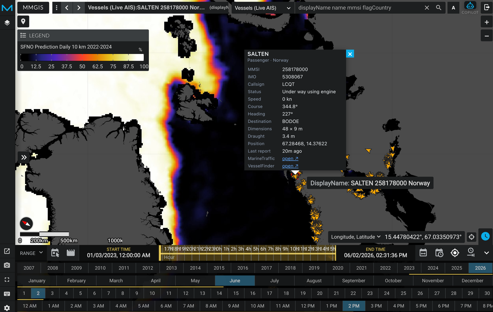

# MMGIS Vessels Plugin (Backend)

Real-time AIS ship position tracking via [AISStream.io](https://aisstream.io) WebSocket feed.


*Live vessel tracking showing SALTEN (passenger vessel, Norway) with detailed vessel information and sea ice forecast overlay*

## Overview

This plugin provides backend infrastructure for live vessel tracking and historical replay:

- **WebSocket client** connecting to AISStream.io for global AIS data
- **In-memory cache** with TTL eviction (default 60 minutes)
- **PostGIS persistence** with 7-day rolling retention
- **REST API** for live positions, historical replay, and track queries
- **Ice concentration sampling** to identify vessels in sea ice

## Features

- Live vessel positions with 30-second refresh
- Historical replay via time slider (7-day window)
- Vessel tracks (last 200 positions per MMSI)
- Country flag decoding from MMSI MID table (269 countries)
- Ice concentration cross-reference with forecast layers
- Configurable bounding box subscription (default: Arctic ≥60°N)

## API Endpoints

| Endpoint | Description |
|----------|-------------|
| `GET /api/vessels/live` | Live or historical vessel positions (GeoJSON) |
| `GET /api/vessels/track?mmsi=...` | Historical track for one vessel (GeoJSON LineString) |
| `GET /api/vessels/in-ice` | Vessels in ≥N% ice concentration |
| `GET /api/vessels/forecast-dates` | Available forecast dates |
| `GET /api/vessels/status` | WebSocket connection diagnostics |

## Environment Configuration

Add to `.env`:

```bash
# Enable vessels plugin (required)
WITH_VESSELS=true

# AISStream.io API key (required) — free at https://aisstream.io
AISSTREAM_API_KEY=your-api-key-here

# Bounding box subscription (optional)
# Default: Arctic only [[[60, -180], [90, 180]]]
# Format: JSON array of [[lat,lon],[lat,lon]] boxes (lat,lon NOT lon,lat!)
AISSTREAM_BBOX=[[[60,-180],[90,180]]]

# In-memory cache TTL (optional, default 60 minutes)
AISSTREAM_TTL_MINUTES=60

# PostGIS history retention (optional, default 7 days)
# Set to 0 to disable persistence
VESSEL_HISTORY_DAYS=7
```

## Database Schema

```sql
CREATE TABLE vessel_positions (
  id BIGSERIAL PRIMARY KEY,
  mmsi VARCHAR(15) NOT NULL,
  lon DOUBLE PRECISION NOT NULL,
  lat DOUBLE PRECISION NOT NULL,
  speed REAL,
  course REAL,
  t_utc TIMESTAMP NOT NULL,
  created_at TIMESTAMP DEFAULT NOW(),
  updated_at TIMESTAMP DEFAULT NOW()
);

CREATE INDEX idx_vessel_positions_mmsi_t_utc
  ON vessel_positions (mmsi, t_utc DESC);
```

**Retention:** Automatic cleanup every 30 minutes, configured via `VESSEL_HISTORY_DAYS`.

**Write throttling:** Maximum 1 row per MMSI per 60 seconds to prevent DB bloat.

## MMGIS Layer Configuration

Add this vector layer to your mission config:

```json
{
  "name": "Vessels (Live AIS)",
  "type": "vector",
  "url": "/api/vessels/live",
  "time": {
    "enabled": true,
    "endtime": "endtime",
    "timefield": "lastSeen",
    "format": "ISO 8601",
    "refreshIntervalEnabled": true,
    "refreshIntervalAmount": 30
  },
  "style": {
    "useKeyAsName": "displayName",
    "radius": 6,
    "fillColor": "#00aaff",
    "color": "#ffffff",
    "weight": 1,
    "fillOpacity": 0.85
  },
  "initialwindowstart": "2026-05-04T20:00:00Z",
  "initialwindowend": "now"
}
```

## File Structure

```
API/MMGIS-Plugin-Backend/Vessels/
├── setup.js                    # Plugin lifecycle & registration
├── aisstreamClient.js          # WebSocket client & in-memory cache
├── routes/
│   └── vessels.js              # REST API endpoints
├── models/
│   └── vesselPosition.js       # PostGIS table schema
├── midTable.js                 # MMSI → Country code decoder
├── iceSampler.js               # Ice concentration sampling
└── README.md                   # Original documentation
```

## Usage Notes

- **Free tier:** AISStream.io offers free API key with global coverage
- **Arctic focus:** Default bbox `[[[60, -180], [90, 180]]]` covers all latitudes ≥60°N
- **Global coverage:** Use `[[[-90, -180], [90, 180]]]` for entire world
- **Bbox format:** `[[lat,lon],[lat,lon]]` (lat first, NOT lon first!)
- **Vessel density:** Arctic has modest coverage; expect tens to low hundreds of vessels

## Integration with Frontend

This backend plugin is designed to work with the **VesselVisualization** frontend plugin at `src/essence/MMGIS-Plugin-Tools/VesselVisualization/`.

Together they provide:
- Rich vessel popups with metadata and external links
- Auto-draw tracks on vessel click
- Time slider historical replay
- AI Copilot integration

## Development

To test the plugin:

1. Get free API key from https://aisstream.io
2. Add to `.env`: `WITH_VESSELS=true` and `AISSTREAM_API_KEY=...`
3. Restart MMGIS: `npm start`
4. Check status: `curl http://localhost:8888/api/vessels/status`
5. View live vessels: `curl http://localhost:8888/api/vessels/live | jq`

## References

- **AISStream.io docs:** https://aisstream.io/documentation
- **WebSocket URL:** `wss://stream.aisstream.io/v0/stream`
- **MMGIS documentation:** `/docs/vessel-tracking-integration.md`
- **Code map:** `/VESSEL-TRACKING-CODE-MAP.md`
