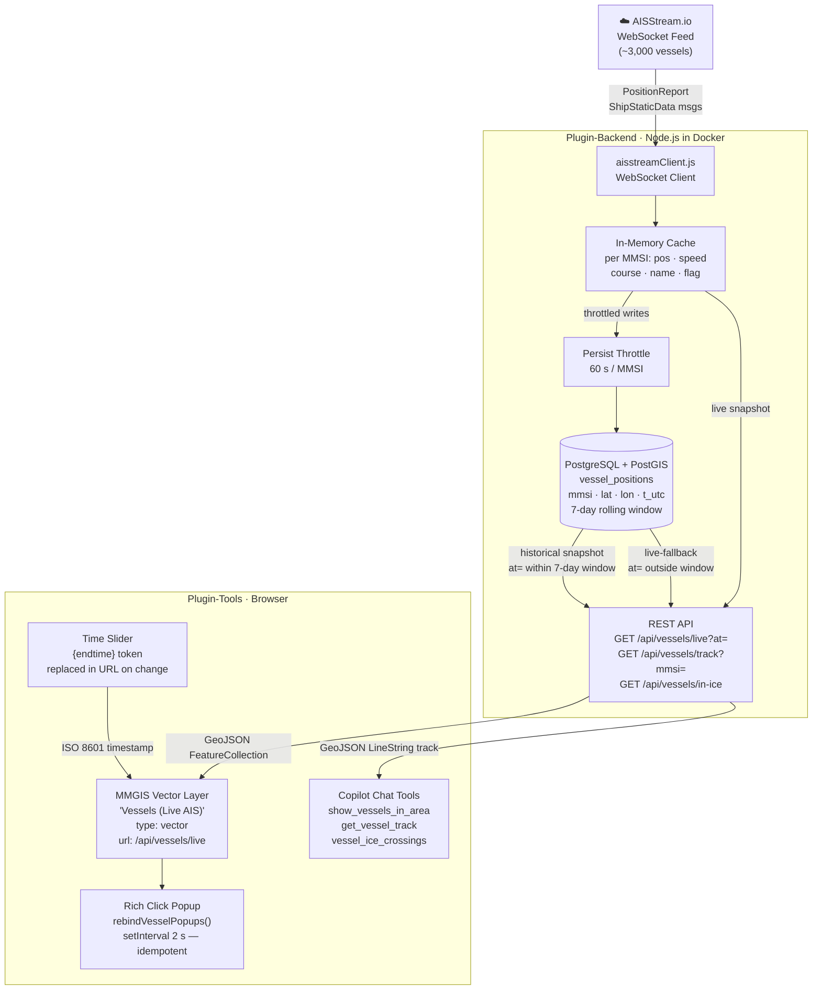
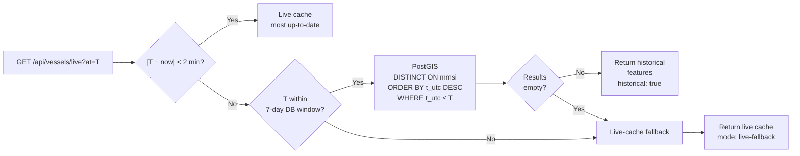

# MMGIS Vessels Plugin (Backend)

Real-time AIS ship position tracking via [AISStream.io](https://aisstream.io) WebSocket feed.


*Live vessel tracking showing SALTEN (passenger vessel, Norway) with detailed vessel information and sea ice forecast overlay*

---

## Table of Contents

1. [Overview](#overview)
2. [Features](#features)
3. [Architecture](#architecture)
4. [API Endpoints](#api-endpoints)
5. [Environment Configuration](#environment-configuration)
6. [Database Schema](#database-schema)
7. [MMGIS Layer Configuration](#mmgis-layer-configuration)
8. [File Structure](#file-structure)
9. [Data Flow](#data-flow)
10. [Frontend Integration](#frontend-integration)
11. [Historical Replay](#historical-replay)
12. [Rich Vessel Popups](#rich-vessel-popups)
13. [Copilot Chat Tools](#copilot-chat-tools)
14. [Development](#development)
15. [Troubleshooting](#troubleshooting)
16. [Key Design Decisions](#key-design-decisions)

---

## Overview

This plugin provides backend infrastructure for live vessel tracking and historical replay:

- **WebSocket client** connecting to AISStream.io for global AIS data
- **In-memory cache** with TTL eviction (default 60 minutes)
- **PostGIS persistence** with 7-day rolling retention
- **REST API** for live positions, historical replay, and track queries
- **Ice concentration sampling** to identify vessels in sea ice

| Feature | Detail |
|---|---|
| Data source | AISStream.io WebSocket (free tier, global AIS) |
| Coverage | Arctic + global open ocean (~3,000 vessels in range) |
| Update rate | Live: 30 s auto-refresh · DB persist: 60 s / vessel |
| Historical window | 7-day rolling retention in PostGIS |
| Replay | MMGIS time slider sends `{endtime}` → `/api/vessels/live?at=` |

---

## Features

- Live vessel positions with 30-second refresh
- Historical replay via time slider (7-day window)
- Vessel tracks (last 200 positions per MMSI)
- Country flag decoding from MMSI MID table (269 countries)
- Ice concentration cross-reference with forecast layers
- Configurable bounding box subscription (default: Arctic ≥60°N)

---

## Architecture



---

## API Endpoints

### `GET /api/vessels/live`

Returns a GeoJSON `FeatureCollection` of all known vessels.

| Query param | Type | Description |
|---|---|---|
| `at` | ISO 8601 string | Historical replay timestamp. Omit for live cache. |
| `bounds` | `minLon,minLat,maxLon,maxLat` | Restrict to bounding box |
| `types` | `Cargo,Tanker` | Case-insensitive substring match on `shipTypeText` |
| `flags` | `NO,RU,US` | ISO-2 country code filter |
| `windowMinutes` | integer (default 60) | Look-back window for historical `at=` query |

**Response meta block:**

```json
{
  "_meta": {
    "mode": "historical | live | live-fallback",
    "at": "2026-05-04T18:00:00.000Z",
    "count": 2847
  }
}
```

### `GET /api/vessels/track`

Returns a GeoJSON `LineString` of the vessel's recorded positions.

| Query param | Type | Description |
|---|---|---|
| `mmsi` | string | **Required.** 9-digit MMSI |
| `hours` | number (default 24, max 168) | Look-back window in hours |

Sources in order: PostGIS (durable) → in-memory ring buffer.

### `GET /api/vessels/in-ice`

Returns vessels currently navigating through sea-ice concentration ≥ threshold.

| Query param | Type | Description |
|---|---|---|
| `threshold` | number (default 15) | Minimum ice concentration % |
| `layer` | string | STAC collection name (default `forecast-7day-PRED`) |

### `GET /api/vessels/forecast-dates`

Returns available forecast dates from the STAC collection.

### `GET /api/vessels/status`

Returns server status: WebSocket connection state, cache size, DB row count, uptime.

**Response:**
```json
{
  "status": "connected",
  "vessels": 1234,
  "messageCount": 56789,
  "connectedAt": "2026-06-01T10:00:00Z",
  "lastMessageAt": "2026-06-01T12:34:56Z",
  "lastError": null
}
```

---

## Environment Configuration

Add to `.env`:

```bash
# Enable vessels plugin (required)
WITH_VESSELS=true

# AISStream.io API key (required) — free at https://aisstream.io
AISSTREAM_API_KEY=your-api-key-here

# Bounding box subscription (optional)
# Default: Arctic only [[[60, -180], [90, 180]]]
# Format: JSON array of [[lat,lon],[lat,lon]] boxes (lat,lon NOT lon,lat!)
AISSTREAM_BBOX=[[[60,-180],[90,180]]]

# In-memory cache TTL (optional, default 60 minutes)
AISSTREAM_TTL_MINUTES=60

# PostGIS history retention (optional, default 7 days)
# Set to 0 to disable persistence
VESSEL_HISTORY_DAYS=7
```

**Important Notes:**
- **Free tier:** AISStream.io offers a free API key with global coverage
- **Bbox format:** `[[lat,lon],[lat,lon]]` (lat first, NOT lon first!)
- **Arctic default:** `[[[60, -180], [90, 180]]]` covers all latitudes ≥60°N
- **Global coverage:** Use `[[[-90, -180], [90, 180]]]` for entire world

---

## Database Schema

```sql
CREATE TABLE vessel_positions (
  id BIGSERIAL PRIMARY KEY,
  mmsi VARCHAR(15) NOT NULL,
  lon DOUBLE PRECISION NOT NULL,
  lat DOUBLE PRECISION NOT NULL,
  speed REAL,
  course REAL,
  t_utc TIMESTAMP NOT NULL,
  created_at TIMESTAMP DEFAULT NOW(),
  updated_at TIMESTAMP DEFAULT NOW()
);

CREATE INDEX idx_vessel_positions_mmsi_t_utc
  ON vessel_positions (mmsi, t_utc DESC);
```

**Fields:**
- `mmsi` — Maritime Mobile Service Identity (9-digit unique vessel ID)
- `lon`, `lat` — Position in WGS84 decimal degrees
- `speed` — Speed over ground in knots
- `course` — Course over ground in degrees (0–360)
- `t_utc` — Position timestamp (from AIS message)

**Retention:** Automatic cleanup every 30 minutes, configured via `VESSEL_HISTORY_DAYS`.

**Write throttling:** Maximum 1 row per MMSI per 60 seconds to prevent DB bloat.

---

## MMGIS Layer Configuration

Add this vector layer to your mission config:

```json
{
  "name": "Vessels (Live AIS)",
  "type": "vector",
  "url": "/api/vessels/live",
  "time": {
    "enabled": true,
    "endtime": "endtime",
    "timefield": "lastSeen",
    "format": "ISO 8601",
    "refreshIntervalEnabled": true,
    "refreshIntervalAmount": 30
  },
  "style": {
    "useKeyAsName": "displayName",
    "radius": 6,
    "fillColor": "#00aaff",
    "color": "#ffffff",
    "weight": 1,
    "fillOpacity": 0.85
  },
  "initialwindowstart": "2026-05-04T20:00:00Z",
  "initialwindowend": "now"
}
```

> ⚠️ `initialwindowstart` must be an **absolute ISO timestamp**. `TimeUI.js` supports `"now"` for `initialwindowend` but does **not** parse `"now - N"` for the start. Always insert a real date.

### Insert mission config (SQL)

```sql
INSERT INTO configs (mission, version, config)
SELECT mission, MAX(version) + 1,
       jsonb_set(config::jsonb,
         '{layers, <your_group_index>, sublayers}',
         (config::jsonb -> 'layers' -> <idx> -> 'sublayers') || '<vessel_layer_json>'::jsonb
       )::text
FROM configs
WHERE mission = 'frozon_ai_forecast'
GROUP BY mission, config
ORDER BY version DESC
LIMIT 1;
```

---

## File Structure

```
API/MMGIS-Plugin-Backend/Vessels/
├── setup.js                    # Plugin lifecycle & registration
├── aisstreamClient.js          # WebSocket client & in-memory cache
├── routes/
│   └── vessels.js              # REST API endpoints
├── models/
│   └── vesselPosition.js       # PostGIS table schema
├── midTable.js                 # MMSI → Country code decoder
├── iceSampler.js               # Ice concentration sampling
└── README.md                   # This file
```

---

## Data Flow

### Ingest path

```
AISStream.io WebSocket
  ↓  PositionReport  (pos · speed · course · heading · nav status — every 2 s–3 min)
  ↓  ShipStaticData  (name · IMO · dimensions · draught — every ~6 min)
      ↓
  aisstreamClient.js  — merges both types into one in-memory entry per MMSI
      ↓
  Persist throttle (60 s/MMSI)  →  vessel_positions  (PostGIS)
```

### Query path

```
Browser time slider changes
  → LayerCapturer.js replaces {endtime} in URL → ?at=2026-05-04T18:00:00Z
  → GET /api/vessels/live?at=…
  → mode selection (see Historical Replay section)
  → GeoJSON FeatureCollection returned
  → Leaflet redraws markers
  → setInterval rebindVesselPopups() re-attaches popup HTML to new markers
```

### Country decode

MMSI first 3 digits → MID table → ISO-2 country code → `displayName` and `flag` properties.

---

## Frontend Integration

This backend plugin is designed to work with the **VesselVisualization** frontend plugin at `src/essence/MMGIS-Plugin-Tools/VesselVisualization/`.

Together they provide:
- Rich vessel popups with metadata and external links
- Auto-draw tracks on vessel click
- Time slider historical replay
- AI Copilot integration

### GeoJSON Feature Properties

Each `Feature` in the `FeatureCollection` carries:

| Property | Type | Description |
|---|---|---|
| `mmsi` | string | Maritime Mobile Service Identity (9 digits) |
| `name` | string | Vessel name from `ShipStaticData` |
| `displayName` | string | `"NAME MMSI Country"` — used for mouseover label |
| `imo` | string | IMO number (if broadcast) |
| `callSign` | string | Radio call sign |
| `flag` | string | ISO-2 country derived from MMSI MID |
| `shipType` | number | ITU-R numeric type code |
| `navStatusText` | string | Human readable e.g. `"Under Way Using Engine"` |
| `speedKn` | string | Speed over ground in knots |
| `courseDeg` | string | Course over ground in degrees |
| `headingDeg` | string \| null | True heading in degrees; `null` when AIS sends `511` (not available) |
| `lat` / `lon` | number | Last known WGS-84 position |
| `position` | string | `"70.12°N, 25.34°E"` display string |
| `lastReport` | string | Human age: `"3 min ago"` |
| `lastSeen` | string | ISO 8601 UTC timestamp |
| `draught` | string | Draught in metres (if broadcast) |
| `marineTrafficUrl` | string | Deep link to MarineTraffic vessel page |
| `vesselFinderUrl` | string | Deep link to VesselFinder vessel page |
| `historical` | boolean | `true` = served from PostGIS, `false` = live cache |

---

## Historical Replay

The `/live?at=` endpoint uses a three-mode strategy so the layer **never appears blank**:



| Mode | Condition | Source | `_meta.mode` |
|---|---|---|---|
| **Live** | No `at=` or `\|Δt\| < 2 min` | In-memory cache | `"live"` |
| **Historical** | `\|Δt\| ≤ 7 days` and DB has rows | PostGIS `DISTINCT ON` | `"historical"` |
| **Fallback** | Outside DB window or empty result | Live cache | `"live-fallback"` |

---

## Rich Vessel Popups

### Why a custom popup system is needed

MMGIS's `getFeaturePropertiesOnClick: true` only works for `geodatasets:` URL layers.  
The vessel layer uses an `/api/...` URL so it gets no automatic click handling.  
Additionally, the MMGIS time slider rebuilds Leaflet markers on every tick — destroying  
any popups bound in the previous render cycle.

### Solution: `rebindVesselPopups()` + `setInterval`

```js
// renderers.js — runs in the browser after every layer reload
function rebindVesselPopups() {
  const layerGroup = resolveVesselLayer();   // tries UUID → display name → scan
  if (!layerGroup) return;

  layerGroup.eachLayer((marker) => {
    if (marker.getPopup()) return;           // idempotent — skip already-bound markers
    const p = marker.feature?.properties;
    if (!p?.mmsi) return;
    marker.bindPopup(buildVesselPopupHTML(p), { maxWidth: 340, className: "vessel-popup" });
  });
}

setInterval(rebindVesselPopups, 2000);       // 2 s — cheap walk, only binds new markers
```

### Popup card fields

```
┌────────────────────────────────────┐
│ 🚢  AURORA BOREALIS                │  ← name
│     MMSI 259012345  🇳🇴 Norway      │  ← MMSI + flag
│                                    │
│  Speed     12.4 kn                 │
│  Course    045°                    │
│  Heading   042°                    │
│  Status    Under Way Using Engine  │
│  Position  70.34°N, 24.11°E        │
│  Draught   6.2 m                   │
│  Last seen 4 min ago               │
│                                    │
│  [MarineTraffic ↗]  [VesselFinder ↗]│
└────────────────────────────────────┘
```

---

## Copilot Chat Tools

These tools are registered in `tool-registry.json` and handled by `renderers.js`:

| Tool name | Trigger phrase | What it does |
|---|---|---|
| `show_vessels_in_area` | "show ships near X" | Renders vessel markers in a bbox as a temporary overlay |
| `get_vessel_track` | "track vessel MMSI" | Draws 7-day route polyline on the map |
| `vessel_ice_crossings` | "vessels in ice" | Identifies vessels in high sea-ice concentration areas |
| `get_vessel_info` | "info on vessel X" | Returns enriched metadata card for a vessel by MMSI or name |

### Adding a new Copilot tool

Three locations must all agree:

1. **`tool-registry.json`** — add entry with unique `name` and `execution.ui.type`
2. **`renderers.js`** — export `render_<type>` and register it in the `RENDERERS` map
3. **`provider.js` `buildPrompt()`** — add a quick-reference example; without one the LLM tends to say "I don't have a tool for that"

---

## Development

To test the plugin:

1. Get free API key from https://aisstream.io
2. Add to `.env`: `WITH_VESSELS=true` and `AISSTREAM_API_KEY=...`
3. Restart MMGIS: `npm start`
4. Check status: `curl http://localhost:8888/api/vessels/status`
5. View live vessels: `curl http://localhost:8888/api/vessels/live | jq`

### Build and ship the frontend bundle

```bash
# In MMGIS repo root:
npm run build                                          # ~3 min

docker cp build/. mmgis-mmgis-1:/usr/src/app/build/
docker restart mmgis-mmgis-1
```

Then hard-refresh the browser (**Cmd+Shift+R** on macOS / **Ctrl+Shift+R** on Windows).  
The bundle filename hash changes on every build — the old bundle will not auto-update.

### Verify

Open `http://localhost:8889/?mission=frozon_ai_forecast`, enable the **Vessels (Live AIS)** layer,  
and confirm:

- Blue dots appear across the Arctic
- Mouseover shows `"VESSEL_NAME MMSI Country"`
- Click opens the rich popup card
- Moving the time slider changes positions (check Network tab for `?at=` param)

---

## Troubleshooting

| Symptom | Likely cause | Fix |
|---|---|---|
| No vessels appear | `AISSTREAM_API_KEY` missing or WS not connected | Check backend logs for `"AISStream WS opened"`. Verify `.env`. |
| Only port vessels visible | WebSocket warmed up but not enough time elapsed | Wait 2–5 min. Underway vessels broadcast every 2–10 s. |
| Vessels don't move on slider | `time.enabled` or `endtime` missing from layer config | Ensure time block is present; check Network tab for `?at=` param. |
| Popups disappear after 30 s | Leaflet markers rebuilt without popup re-bind | `setInterval(rebindVesselPopups, 2000)` is the fix. Redeploy latest bundle. |
| Slider lands outside vessel data | `initialwindowstart` too old or in wrong format | Must be absolute ISO within last 7 days. No `"now-N"` syntax. |
| Historical slider shows live data | `at=` not appended to URL | Check `time.endtime` key matches the slider end param name exactly. |
| No data after container restart | Expected — live cache rebuilds in ~2 min | Historical DB data is available immediately. Live cache fills as messages arrive. |
| `/stac/*` returns 504 | STAC sidecar missing network alias | `docker network connect --alias stac-fastapi mmgis_default mmgis-stac-api` |

---

## Key Design Decisions

### Why WebSocket in Backend, Not Frontend?

❌ **Frontend WebSocket (rejected):**
- Would expose API key in browser
- One upstream connection per visitor
- Rate limit issues
- Can't persist to PostGIS from browser

✅ **Backend WebSocket (chosen):**
- API key stays server-side
- Single shared connection for all users
- Efficient caching + bbox filtering
- Easy persistence to PostGIS

### Why In-Memory Cache + PostGIS?

- **In-memory cache:** Ultra-fast live queries (< 1 ms)
- **PostGIS persistence:** Historical replay + track drawing
- **Write throttling:** Prevents DB bloat (1 row/MMSI/min)
- **TTL eviction:** Auto-cleanup of stale vessels

### `rebindVesselPopups()` interval — why not subscriptions?

`_timeLayerReloadFinishSubscriptions` in `LayerCapturer.js` only fires inside the `geodatasets:` URL branch. The vessel layer URL is `/api/vessels/live` so this subscription never triggers. `setInterval(rebindVesselPopups, 2000)` with an idempotent `m.getPopup()` check is the correct workaround — negligible CPU, reliable popup persistence.

### Persist throttle — 60 s/MMSI

At ~3,000 vessels broadcasting every 2–10 s, writing every message would be ~18,000 rows/min. A 60-second per-MMSI throttle brings this to ~3,000 rows/min — manageable for PostGIS. Combined with 7-day retention, this produces ~30 M rows maximum, well within range for a properly indexed PostGIS table.

### `displayName` over `name` for mouseover

MMGIS uses `useKeyAsName` to pick the mouseover label. Using `"NAME MMSI Country"` as the display string lets operators immediately identify a vessel without clicking — critical in dense Arctic shipping lanes.

### Historical live-fallback prevents blank layers

When the time slider is dragged to a date outside the 7-day DB window (e.g. the default ice-forecast era of 2023–2024), the backend falls back to the live cache instead of returning an empty `FeatureCollection`. This prevents the layer from mysteriously disappearing and provides a clear `_meta.mode: "live-fallback"` signal for debugging.

---

## References

- **AISStream.io docs:** https://aisstream.io/documentation
- **WebSocket URL:** `wss://stream.aisstream.io/v0/stream`
- **Full integration docs:** See sections below from related documentation

---

## Related Files

### Backend Components

| File | Role |
|---|---|
| `aisstreamClient.js` | WebSocket client · in-memory cache · throttle · `toGeoJSON()` · `getHistoricalSnapshot()` |
| `routes/vessels.js` | REST endpoints: `/live`, `/track`, `/in-ice`, `/status` |
| `models/vesselPosition.js` | Sequelize model — `vessel_positions` table with index `(mmsi, t_utc DESC)` |
| `midTable.js` | MMSI MID → ISO-2 country lookup table |
| `iceSampler.js` | `vesselsInIce()` — spatial join against STAC sea-ice tiles |
| `setup.js` | Plugin entry point; wires `VesselPosition` model into client constructor |

### Frontend Components

| File | Role |
|---|---|
| `src/essence/Frozon-MMGIS-Plugin-Tools/AgentChat/renderers.js` | `buildVesselPopupHTML()` · `rebindVesselPopups()` · `installVesselClickTrackHandler()` |
| `src/essence/Frozon-MMGIS-Plugin-Tools/AgentChat/AgentChatTool.js` | Chat panel + topbar Copilot button |

### MMGIS Core (read-only context)

| File | Relevant detail |
|---|---|
| `src/essence/Basics/Layers_/LayerCapturer.js` | `{endtime}` substitution; `_timeLayerReloadFinishSubscriptions` only fires for `geodatasets:` URLs |
| `src/essence/Basics/TimeControl_/TimeUI.js` | Supports `"now"` literal for `initialend`/`initialwindowend`; `initialwindowstart` requires absolute ISO date |

---

## Summary

✅ **Real-time AIS tracking** via AISStream.io WebSocket  
✅ **Backend plugin** with in-memory cache + PostGIS persistence  
✅ **REST API** for live positions, historical replay, tracks  
✅ **Frontend integration** via MMGIS vector layer + time slider  
✅ **Rich popups** with vessel metadata + external links  
✅ **Copilot tools** for AI-assisted vessel queries  
✅ **7-day rolling history** for track visualization  

**Usage notes:**
- **Free tier:** AISStream.io offers free API key with global coverage
- **Arctic focus:** Default bbox `[[[60, -180], [90, 180]]]` covers all latitudes ≥60°N
- **Global coverage:** Use `[[[-90, -180], [90, 180]]]` for entire world
- **Bbox format:** `[[lat,lon],[lat,lon]]` (lat first, NOT lon first!)
- **Vessel density:** Arctic has modest coverage; expect tens to low hundreds of vessels
